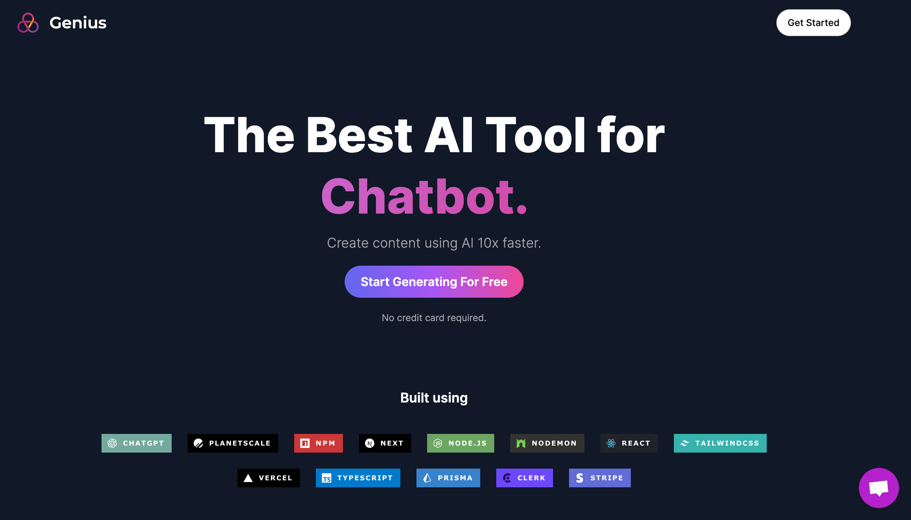

# Genius : AI-Powered Saas

[](https://opensource.org/licenses/MIT)
[](https://opensource.org/licenses/MIT)
[](https://nextjs.org/)
[](https://openai.com/)
[](https://replicate.ai/)
[](https://tailwindcss.com/)
[](https://prisma.io/)
[](https://stripe.com/)

Genius, a dynamic SaaS application, seamlessly integrates cutting-edge technologies like Next.js, OpenAI, Replicate, Tailwind CSS, Prisma, and Stripe. Designed with a user-centric approach, Genius empowers users with AI-driven services, offering a free tier with 5 accesses and a pro plan for expanded usage. The integrated Stripe API ensures secure and efficient payment processing for a seamless experience. Elevate your projects with Genius and unlock the full potential of artificial intelligence.


### AI services offered :

- `Conversation` : Genius AI can respond to any queries you might have using OpenAI API
- `Code Generation` : Genius can generate code snippets related to prompts given such as : "Toggle button using react and tailwindcss"
- `Image Generation` : The application can generate upto 5 images related to given prompt with given resolutions : 256x256 , 512x512, 1024x1024
- `Audio & Generation` : It also has capability to generate audio and video relating to prompts given by user using Replicate AI API

### Subscription Tiers:

Genius caters to diverse user needs with its two-tier model. The `Free-tier` provides users with access to the platform for up to 5 sessions, ensuring a taste of its capabilities. For enthusiasts and professionals seeking expanded functionality, the `Pro plan` opens the door to unlimited access, delivering a premium AI experience.

## Screenshots




## Features

- **AI Services**: Genius provides an extensive array of AI services, including conversation, code generation, image generation, music generation, and video generation. These services are accessible through an intuitive and user-friendly interface.

- **Next.js**: Genius is built on the Next.js framework, offering server-side rendering, routing, and other essential features out of the box. This ensures superior performance and search engine optimization (SEO) for the application.

- **OpenAI Integration**: The application seamlessly integrates with OpenAI's powerful AI models and APIs, enabling users to leverage state-of-the-art AI capabilities. From generating human-like text to answering questions, Genius AI harnesses the full potential of OpenAI.

- **Replicate**: Genius AI employs Replicate to enhance model reproducibility and facilitate seamless experimentation with various AI models. This ensures the AI models used in the application are robust and reliable.

- **Tailwind CSS**: The UI of Genius AI is meticulously styled using Tailwind CSS, a utility-first CSS framework. This enables easy customization and consistent design throughout the application.

- **Prisma**: The application utilizes Prisma as its ORM (Object-Relational Mapping) tool, simplifying database access and management. This enhances the efficiency of handling user data and preferences.

- **Stripe Integration**: The service seamlessly incorporates Stripe for secure and efficient payment processing. Users can subscribe to premium plans and access additional AI services based on their subscription level.

## Getting Started

First, run the development server:

```bash
npm run dev
# or
yarn dev
# or
pnpm dev
# or
bun dev
```

Open [http://localhost:3000](http://localhost:3000) with your browser to see the result.

You can start editing the page by modifying `app/page.tsx`. The page auto-updates as you edit the file.

This project uses [`next/font`](https://nextjs.org/docs/basic-features/font-optimization) to automatically optimize and load Inter, a custom Google Font.
